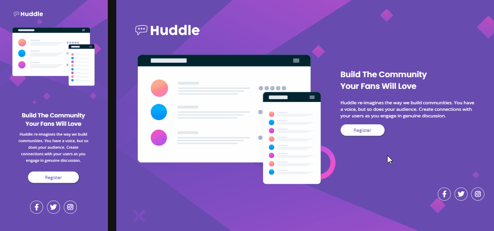

# Frontend Mentor - Huddle landing page with single introductory section solution

## Table of contents

  - [The challenge](#the-challenge)
  - [gif](#gif)
  - [Built with](#built-with)
  - [What I learned](#what-i-learned)

### The challenge

Users should be able to:

- View the optimal layout for the page depending on their device's screen size
- See hover states for all interactive elements on the page

### Gif

### Built with

- Semantic HTML5 markup
- CSS custom properties
- Flexbox

### What I learned

Although simple, this project proved itself a good one to exercise the use and concepts of css, flexbox and responsive web design. I made the page to be fully responsive on the usual resolutions, from 1440px to 325px.
